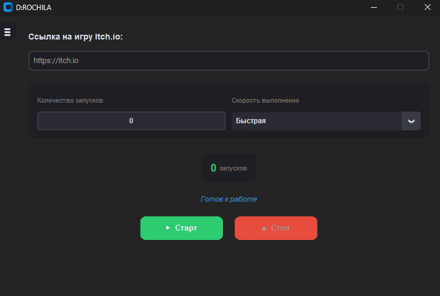
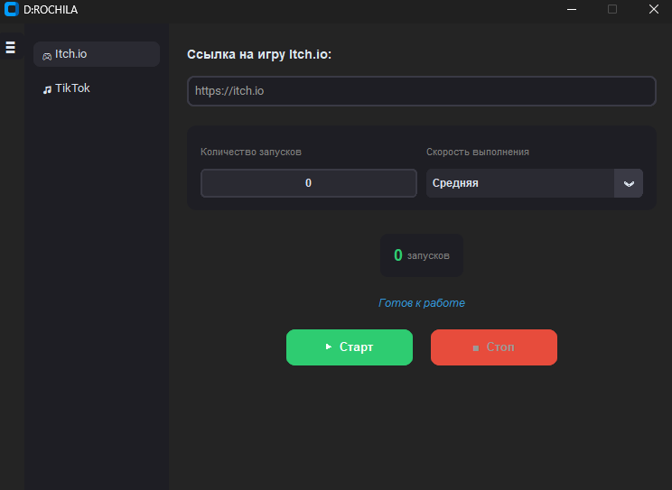
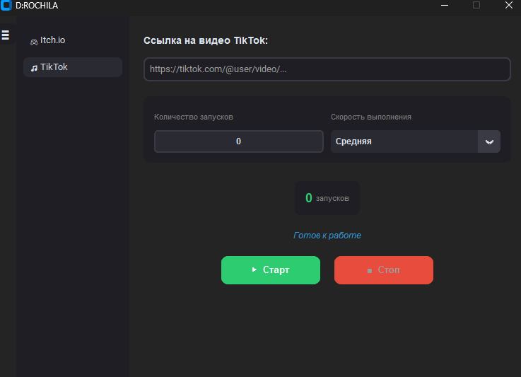

# 🚀 itch.io Automation

### traffic generator

---

# 📖 About

**itch.io Automation** is a Python desktop application created to automate repetitive actions in a web browser.

The current implementation contains two automation modules:

- **Itch.io** — automates opening game pages and simulates short play sessions.
- **TikTok** — automates opening videos and simulates viewing sessions with basic browser interaction.

---

# ✨ Features

### 🎮 Itch.io

- Open game pages automatically
- Click the **Run Game** button
- Simulate viewing/play sessions
- Adjustable session duration

### 🎥 TikTok

- Open video URLs
- Persistent Chrome profile
- Automatic popup handling
- Human-like mouse movement
- Automatic video playback
- Configurable viewing time

---

# 🛠 Technologies

- Python
- Selenium
- undetected-chromedriver
- ChromeDriver
- CustomTkinter

---

# 📸 Screenshots

## Main Window

## Itch.io Module

## TikTok Module

# ⚠ Disclaimer

This repository is published for educational and portfolio purposes.

Users are responsible for ensuring that any use of this software complies with the terms of service of the websites they interact with.

# 👨‍💻 Author

**Ismail Shikhaev**

GitHub: https://github.com/Midoriaw

---

# 📄 License

MIT License
